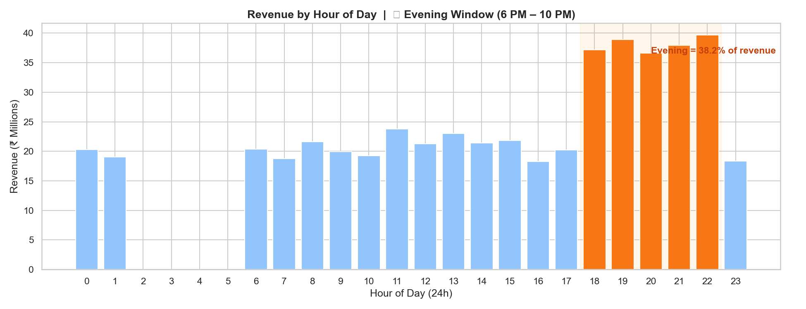
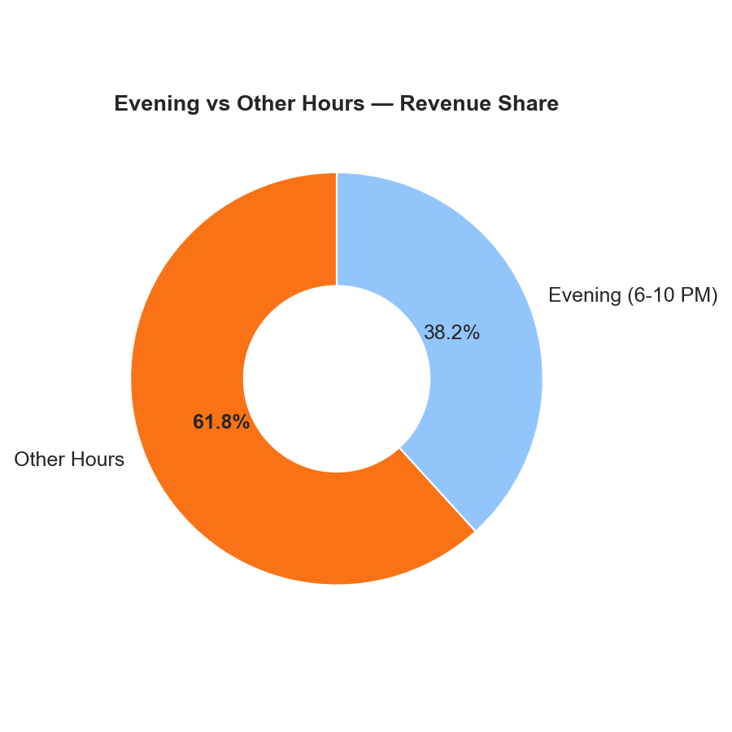
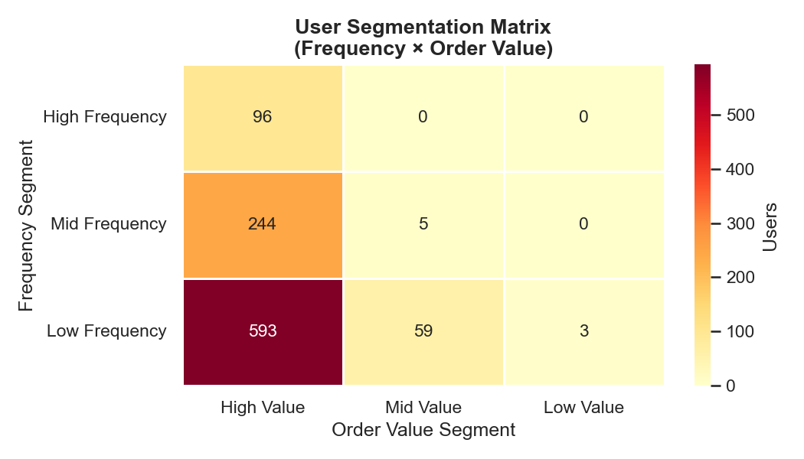
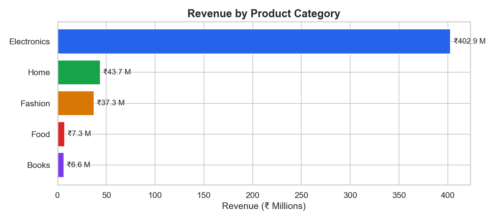
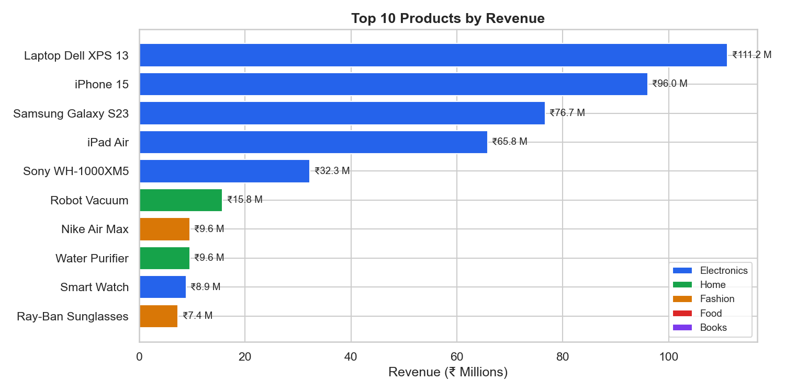
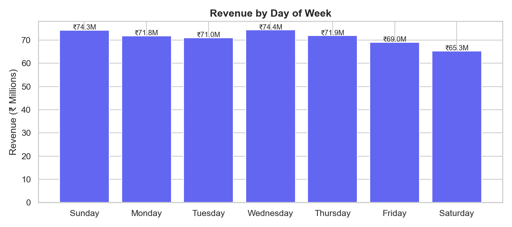
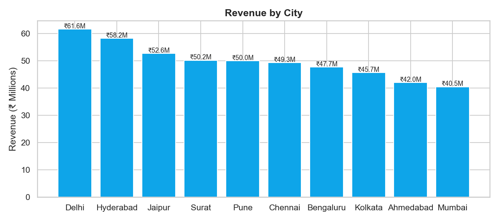

# 📊 Transaction Behavior & Segmentation Analysis

**SQL (MySQL) | Python | Data Analysis | Business Intelligence**

Analyzed 44,000+ transaction line items across 12,000 orders to surface revenue drivers, demand patterns, and high-value user segments — enabling data-backed recommendations for time-targeted campaigns and retention strategy.

---

## 🎯 Key Insights

| Insight | Finding |
|---|---|
| 💰 Total Revenue | ₹49.78 Crore across 10,174 completed orders |
| 🕐 Peak Window | Evening hours (6–10 PM) contribute **38% of total revenue** |
| 🏆 Top Category | Electronics drives **80.93% of revenue** |
| 🏙️ Top City | Delhi leads with ₹6.15 Cr in revenue |
| 👑 Top Product | Laptop Dell XPS 13 — ₹1.11 Cr total revenue |
| 📅 Best Day | Sunday has highest order volume (1,494 orders) |

---

## 🗂️ Project Structure

```
├── 1_schema.sql              # Database design — 4 tables with FK constraints & indexes
├── 2_generate_data.py        # Synthetic data generator — 1K users, 50 products, 12K orders
├── 3_analysis_queries.sql    # 10 business analysis queries
├── 4_visualizations.py       # 7 Python charts (matplotlib + seaborn)
└── charts/
    ├── 01_revenue_by_category.png
    ├── 02_revenue_by_hour.png
    ├── 03_evening_donut.png
    ├── 04_revenue_by_day.png
    ├── 05_user_segmentation_heatmap.png
    ├── 06_top10_products.png
    └── 07_revenue_by_city.png
```

---

## 🗄️ Database Schema

```
users (1,000 rows)
│
└── transactions (12,000 rows)
        │
        └── transaction_items (44,852 rows)
                │
                └── products (50 rows)
```

**Tables:** `users` · `products` · `transactions` · `transaction_items`
**Engine:** MySQL 8.0 | Indexes on `txn_datetime`, `user_id`, `product_id`

---

## 📈 Analysis Queries

| # | Query | Business Question |
|---|---|---|
| 1 | Revenue Overview | Total revenue, AOV, unique customers |
| 2 | Revenue by Category | Which category drives the most revenue? |
| 3 | Revenue by Hour | When do customers spend the most? |
| 4 | Evening vs Other Hours | Quantify the evening revenue window |
| 5 | Revenue by Day of Week | Which days have peak demand? |
| 6 | Revenue by City | Which cities are top markets? |
| 7 | User Segmentation | Frequency × Order Value matrix |
| 8 | VIP Users | Top 10 high-value customers |
| 9 | Churn Risk Users | Users inactive for 90+ days |
| 10 | Top Products | Best-selling products by revenue |

---

## 📊 Charts

### Revenue by Hour of Day


### Evening vs Other Hours


### User Segmentation Heatmap


### Revenue by Category


### Top 10 Products


### Revenue by Day of Week


### Revenue by City


---

## 💡 Business Recommendations

**1. Time-Targeted Campaigns**
Evening hours (6–10 PM) consistently drive ~38% of daily revenue. Push notifications, flash sales, and email campaigns scheduled in this window would maximize conversion.

**2. Electronics Upsell Strategy**
Electronics dominates at 80%+ of revenue. Bundle recommendations and cross-sell accessories (earbuds, cases, chargers) to high-frequency Electronics buyers to increase AOV.

**3. Retention — Churn Risk Cohort**
164 users with 3+ past orders haven't purchased in 90+ days. A targeted win-back campaign (discount code, personalized email) for this segment can recover lost revenue at low acquisition cost.

**4. VIP Program**
Top 10% of users (High Frequency + High Value segment) contribute disproportionate revenue. A loyalty program or early-access offer for this cohort would strengthen retention.

**5. Geographic Expansion**
Delhi and Hyderabad lead in revenue but Mumbai — despite higher AOV (₹56K) — ranks lower in order volume, suggesting untapped demand worth targeted marketing investment.

---

## 🛠️ Tech Stack

- **Database:** MySQL 8.0
- **Language:** Python 3.14
- **Libraries:** `pandas` · `matplotlib` · `seaborn` · `sqlalchemy` · `faker` · `mysql-connector-python`
- **Tool:** MySQL Workbench

---

## 🚀 How to Run

```bash
# 1. Install dependencies
pip install faker mysql-connector-python sqlalchemy pandas matplotlib seaborn

# 2. Create schema
# Run 1_schema.sql in MySQL Workbench

# 3. Generate data
python 2_generate_data.py

# 4. Run analysis
# Run 3_analysis_queries.sql in MySQL Workbench

# 5. Generate charts
python 4_visualizations.py
```

---

*Built as part of a portfolio project to demonstrate SQL analysis, data generation, and business insight extraction.*
